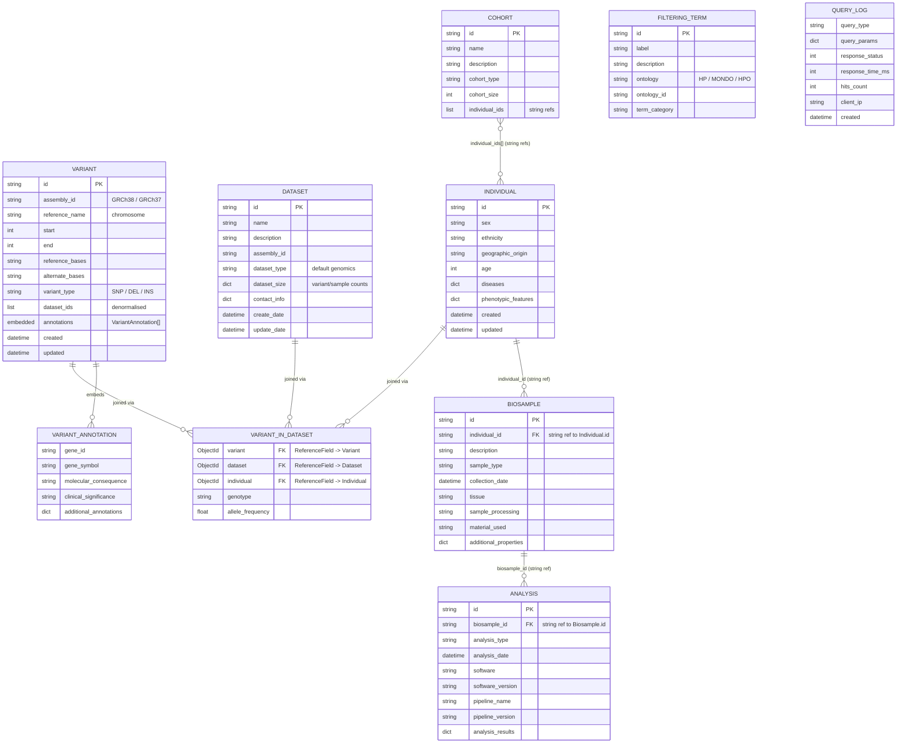
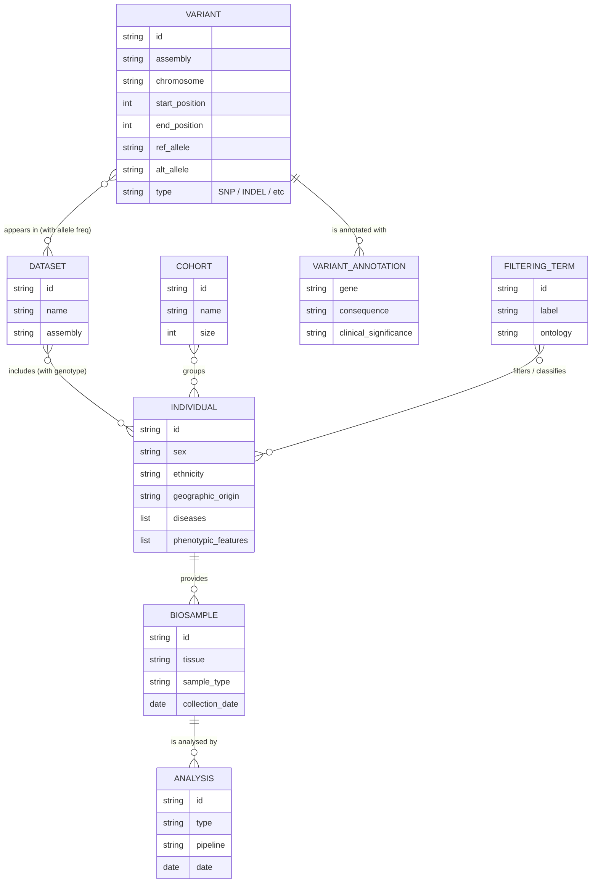
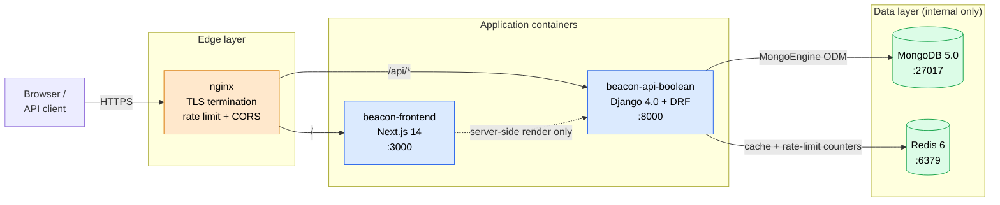
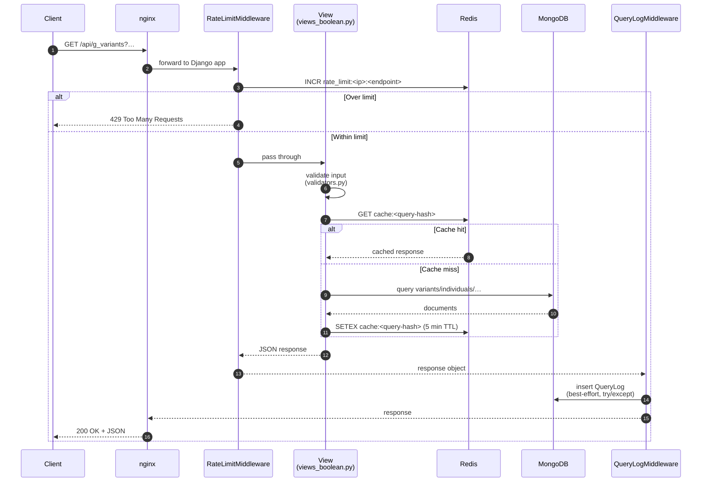
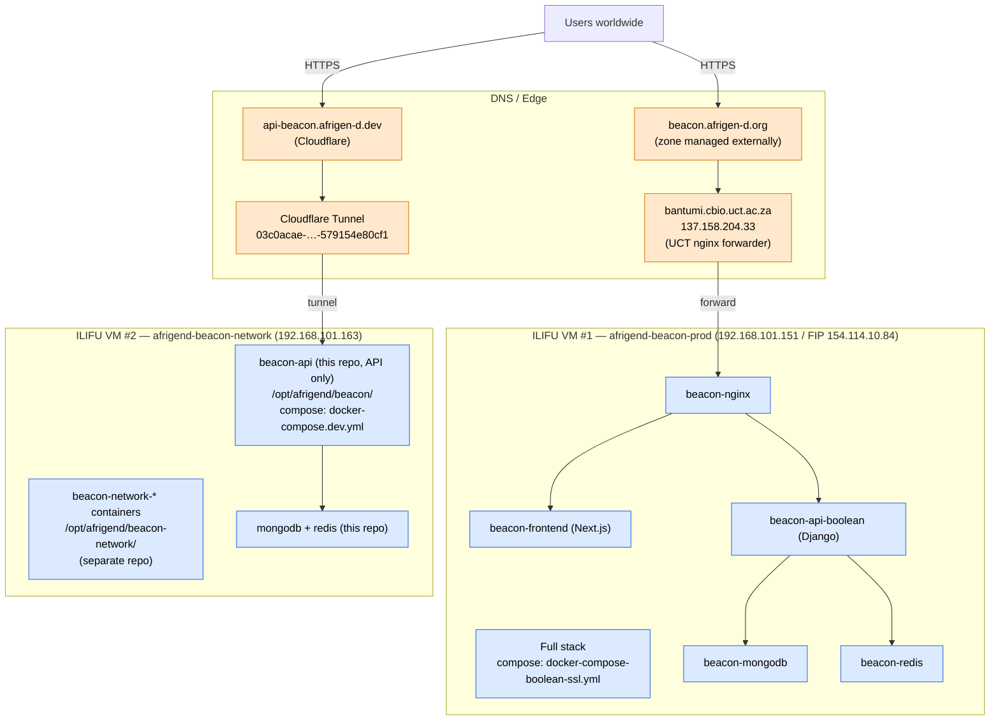

# Afrigen Beacon v2 — Visual Schemas

Visual companion to `DATABASE_SCHEMA.md`. All diagrams use
[Mermaid](https://mermaid.js.org/) and render natively on GitHub, GitLab,
VS Code, and most Markdown viewers.

> **Source-of-truth note**: these diagrams are derived from
> `beacon_api/models.py`, `beacon_api/urls*.py`, and
> `beacon_project/settings_boolean.py`. If the code changes, update the
> diagrams here in the same PR.

## Table of contents

1. [ER diagram — Option A (literal MongoDB / DBA view)](#1-er-diagram--option-a-literal-mongodb-view)
2. [ER diagram — Option B (domain semantics / researcher view)](#2-er-diagram--option-b-domain-semantics-view)
3. [Runtime topology](#3-runtime-topology)
4. [API endpoint map (Boolean vs Secure)](#4-api-endpoint-map-boolean-vs-secure)
5. [Query lifecycle (request → response)](#5-query-lifecycle-request--response)
6. [Production deployment topology](#6-production-deployment-topology)
7. [Technology stack](#7-technology-stack)

---

## 1. ER diagram — Option A (literal MongoDB view)

Mirrors what's actually stored in Mongo. `VariantInDataset` is shown as a
real collection (which it is — `beacon_api/models.py:176-200`). Use this
when working on queries, indexes, migrations, or data loading.

### Storage notes

- **Embedded vs referenced.** `VariantAnnotation` lives inside each `Variant`
  document (read together; no join cost). `VariantInDataset` is its own
  collection because genotype data is dataset-scoped and large.
- **String IDs vs ReferenceFields.** Most cross-collection links are stored as
  plain string IDs (`Biosample.individual_id`, `Analysis.biosample_id`,
  `Cohort.individual_ids[]`). The only true `mongoengine.ReferenceField` joins
  live in `VariantInDataset`. This is deliberate — string IDs let MongoDB
  serve queries without `$lookup` round-trips.
- **Indexes** (`auto_create_index: False` on all models — created manually in
  deployment scripts):
  - `variants`: assembly_id, reference_name, start, reference_bases,
    alternate_bases
  - `biosamples`: individual_id
  - `analyses`: biosample_id
  - `cohorts`: name
  - `filtering_terms`: ontology, ontology_id
  - `variant_in_dataset`: variant, dataset, individual + unique compound
    `(variant, dataset, individual)`
  - `query_logs`: created, query_type, -created (only collection with
    auto-index)

---

## 2. ER diagram — Option B (domain semantics view)

Collapses the storage detail. Use this when explaining the data model to
researchers, in onboarding, or in papers.

`★ Insight ─────────────────────────────────────`
The two diagrams describe the **same data** but optimise for different
reasoning. Option A answers "where does this field live and how is it
indexed?" Option B answers "what are the entities and how do they relate
scientifically?" Keep both in sync — when you add a new field to `models.py`,
update Option A; when the conceptual model changes (new entity type,
redefined relationship), update Option B.
`─────────────────────────────────────────────────`

---

## 3. Runtime topology

What runs where in production. Replaces the ASCII art in `CLAUDE.md` with
a renderable version.

> The `traefik/` directory in the repo is aspirational — production currently
> runs nginx. See `CLAUDE.md` "Runtime topology" for the rationale.

---

## 4. API endpoint map (Boolean vs Secure)

Shows which routes each mode exposes and highlights the **4 unrouted entry
types** flagged in `docs/SPEC_CONFORMANCE.md`.

```mermaid
graph TD
    classDef boolean fill:#dcfce7,stroke:#16a34a,color:#000
    classDef secure fill:#fee2e2,stroke:#dc2626,color:#000
    classDef both fill:#dbeafe,stroke:#2563eb,color:#000
    classDef unrouted fill:#f3f4f6,stroke:#6b7280,color:#6b7280,stroke-dasharray: 5 5

    Root["/api/"] --> Info["Service info"]
    Root --> Discovery["Discovery"]
    Root --> Query["Query / data"]
    Root --> Catalog["Catalog metadata"]

    Info --> R1["GET /<br/>GET /info<br/>GET /service-info"]:::both
    Info --> R2["GET /configuration<br/>GET /entry_types<br/>GET /map"]:::both
    Info --> R3["GET /health"]:::both

    Query --> Q1["GET/POST /g_variants<br/>GET /g_variants/&lt;id&gt;"]:::both
    Query --> Q2["POST /query/variants<br/>POST /query/individuals"]:::boolean
    Query --> Q3["POST /query"]:::secure

    Catalog --> C1["GET /datasets<br/>GET /datasets/&lt;id&gt;"]:::both
    Catalog --> C2["GET /cohorts<br/>GET /cohorts/&lt;id&gt;"]:::both
    Catalog --> C3["GET /filtering_terms<br/>GET /filtering_terms/&lt;id&gt;"]:::both

    Catalog --> C4["GET /individuals<br/>GET /individuals/&lt;id&gt;"]:::secure
    Catalog --> C5["GET /biosamples<br/>GET /biosamples/&lt;id&gt;"]:::secure
    Catalog --> C6["GET /analyses<br/>GET /analyses/&lt;id&gt;"]:::secure

    Discovery --> D1["Boolean: /individuals,<br/>/biosamples, /analyses, /runs<br/>(empty stubs — verifier passes)"]:::unrouted
    Discovery --> D2["Boolean: /datasets/&lt;id&gt;/&lt;entry_type&gt;<br/>(scoped query stub)"]:::unrouted

    legend1["Both modes"]:::both
    legend2["Boolean only"]:::boolean
    legend3["Secure only"]:::secure
    legend4["Stub / spec-compliance only"]:::unrouted
```

| Mode | URL conf | Auth | Use case |
|---|---|---|---|
| **Boolean** | `beacon_api/urls_boolean.py` | none | Public discovery (yes/no) |
| **Secure** | `beacon_api/urls.py` | JWT / AAI | Authenticated detail access |

---

## 5. Query lifecycle (request → response)

Where rate limiting, caching, and audit logging sit. Reflects the actual
middleware order in `beacon_project/settings_boolean.py:51-63`.

### Where to look in code

| Step | File |
|---|---|
| Rate limiting | `beacon_api/middleware.py:13-105` (`RateLimitMiddleware`) |
| Input validation | `beacon_api/validators.py` |
| Boolean view logic | `beacon_api/views_boolean.py` |
| Cache key + TTL | `beacon_project/settings_boolean.py` (`CACHES`); TTL 5 min |
| Audit log write | `beacon_api/middleware.py` (`QueryLogMiddleware`) |
| Audit log model | `beacon_api/models.py:230-245` (`QueryLog`) |

`★ Insight ─────────────────────────────────────`
The middleware order matters: `RateLimitMiddleware` runs **before** the view
(so rejected requests cost zero DB work), and `QueryLogMiddleware` runs
**after** (so it sees the final response status and `numTotalResults`). The
audit write is wrapped in `try/except` — a Mongo blip while logging won't
500 the user-facing response. This is **fail-open by design** for
observability, not security.
`─────────────────────────────────────────────────`

---

## 6. Production deployment topology

Two ILIFU VMs serving different URLs from the same codebase (manual rsync
deploys; CI/CD declared but never validated — see `CLAUDE.md` "CI/CD status").

### Critical operational rules (mirrored from `CLAUDE.md`)

- VM #2 hosts **two unrelated stacks** — this repo's API-only sidecar **and**
  the separate `african-beacon-network` repo. They share the host but not
  the codebase.
- VM #1's working tree at `~/afrigend-beacon2/` has **no `origin` remote**.
  Deploys are manual rsync; `git pull` won't work.
- Until CI/CD is fixed, every deploy goes through the manual steps in
  `CLAUDE.md` "Production Deployment".

---

## 7. Technology stack

Every technology actually used in production, grouped by layer. Versions are
sourced from `requirements.txt`, `frontend/package.json`, `Dockerfile.boolean`,
`frontend/Dockerfile`, and `compose/docker-compose.dev.yml`. See the table
below the diagram for exact versions.

```mermaid
graph TB
    classDef edge fill:#ffe8cc,stroke:#d97706,color:#000
    classDef fe fill:#fef3c7,stroke:#ca8a04,color:#000
    classDef be fill:#dbeafe,stroke:#2563eb,color:#000
    classDef data fill:#dcfce7,stroke:#16a34a,color:#000
    classDef infra fill:#ede9fe,stroke:#7c3aed,color:#000
    classDef test fill:#fce7f3,stroke:#db2777,color:#000
    classDef obs fill:#cffafe,stroke:#0891b2,color:#000

    subgraph EDGE["Edge / network"]
        E1["nginx<br/>(prod TLS + reverse proxy)"]:::edge
        E2["Traefik v3.4<br/>(dev only — file provider)"]:::edge
        E3["Cloudflare Tunnel<br/>(VM #2 → public)"]:::edge
    end

    subgraph FE["Frontend — Next.js app"]
        F1["Next.js 14 (App Router)<br/>React 18 + TypeScript 5"]:::fe
        F2["Tailwind CSS 4<br/>+ Radix Slot, clsx, tailwind-merge, CVA"]:::fe
        F3["TanStack Query<br/>(server state + cache)"]:::fe
        F4["Zustand<br/>(client state)"]:::fe
        F5["react-hook-form + Zod<br/>(forms + validation)"]:::fe
        F6["TanStack Table<br/>(results grid)"]:::fe
        F7["Recharts<br/>(visualisations)"]:::fe
        F8["Axios<br/>(HTTP client)"]:::fe
        F9["Lucide + Heroicons<br/>(icons)"]:::fe
        F10["next-themes<br/>(dark mode)"]:::fe
        F11["react-hot-toast<br/>(notifications)"]:::fe
    end

    subgraph BE["Backend — Django API"]
        B1["Python 3.9-slim"]:::be
        B2["Django 4.0.10"]:::be
        B3["Django REST Framework 3.14<br/>+ drf-spectacular (OpenAPI)"]:::be
        B4["MongoEngine 0.27 ODM<br/>+ django-mongoengine + PyMongo 4.6"]:::be
        B5["djangorestframework-simplejwt<br/>(secure mode auth)"]:::be
        B6["django-cors-headers<br/>+ django-ratelimit"]:::be
        B7["django-redis<br/>(cache backend)"]:::be
        B8["Gunicorn 21<br/>(WSGI server)"]:::be
        B9["WhiteNoise<br/>(static files)"]:::be
        B10["python-decouple, dotenv<br/>(env config)"]:::be
    end

    subgraph DATA["Data layer"]
        D1[("MongoDB 5.0<br/>BSON storage")]:::data
        D2[("Redis 6 (alpine)<br/>cache + rate-limit counters")]:::data
    end

    subgraph INFRA["Infrastructure / build"]
        I1["Docker + Docker Compose"]:::infra
        I2["ILIFU OpenStack VMs<br/>(Ubuntu)"]:::infra
        I3["GitHub Actions<br/>(declared, never validated)"]:::infra
    end

    subgraph TEST["Testing"]
        T1["Playwright (E2E)"]:::test
        T2["Jest + Testing Library<br/>(frontend unit)"]:::test
        T3["Django unittest<br/>(backend)"]:::test
        T4["Locust<br/>(load testing)"]:::test
        T5["beacon-verifier (Rust CLI)<br/>(GA4GH spec conformance)"]:::test
    end

    subgraph OBS["Observability"]
        O1["systemd timer<br/>+ textfile collector"]:::obs
        O2["Prometheus<br/>(scrapes node_exporter)"]:::obs
        O3["Grafana<br/>(dashboard.afrigen-d.dev)"]:::obs
    end

    EDGE -.->|routes traffic to| FE
    EDGE -.->|/api/* to| BE
    FE -->|HTTPS /api/*| BE
    BE -->|MongoEngine| D1
    BE -->|django-redis| D2
    BE -->|writes QueryLog metrics| O1
    O1 --> O2 --> O3
    INFRA -.->|hosts| EDGE
    INFRA -.->|hosts| FE
    INFRA -.->|hosts| BE
    INFRA -.->|hosts| DATA
    TEST -.->|exercises| FE
    TEST -.->|exercises| BE
```

### Versions reference

| Layer | Component | Version | Source |
|---|---|---|---|
| Edge | nginx (prod) | distro pkg | host config |
| Edge | Traefik | v3.4 | `compose/docker-compose.dev.yml` |
| Edge | Cloudflare Tunnel | cloudflared latest | VM #2 systemd |
| FE | Node.js (build/runtime) | 20-alpine | `frontend/Dockerfile` |
| FE | Next.js | 14.2.21 | `frontend/package.json` |
| FE | React | 18.3.1 | `frontend/package.json` |
| FE | TypeScript | 5.x | `frontend/package.json` |
| FE | Tailwind CSS | 4.1.18 | `frontend/package.json` |
| FE | TanStack Query | 5.62.14 | `frontend/package.json` |
| FE | TanStack Table | 8.20.6 | `frontend/package.json` |
| FE | Zustand | 5.0.3 | `frontend/package.json` |
| FE | react-hook-form | 7.54.2 | `frontend/package.json` |
| FE | Zod | 3.24.1 | `frontend/package.json` |
| FE | Axios | 1.7.9 | `frontend/package.json` |
| FE | Recharts | 2.15.0 | `frontend/package.json` |
| BE | Python | 3.9-slim | `Dockerfile.boolean` |
| BE | Django | 4.0.10 | `requirements.txt` |
| BE | DRF | 3.14.0 | `requirements.txt` |
| BE | drf-spectacular | 0.26.5 | `requirements.txt` |
| BE | MongoEngine | 0.27.0 | `requirements.txt` |
| BE | PyMongo | 4.6.1 | `requirements.txt` |
| BE | django-mongoengine | 0.5.4 | `requirements.txt` |
| BE | simplejwt | 5.3.1 | `requirements.txt` |
| BE | django-cors-headers | 4.3.1 | `requirements.txt` |
| BE | django-ratelimit | 4.1.0 | `requirements.txt` |
| BE | django-redis | 5.4.0 | `requirements.txt` |
| BE | redis (Python client) | 5.0.1 | `requirements.txt` |
| BE | Gunicorn | 21.2.0 | `requirements.txt` |
| BE | WhiteNoise | 6.6.0 | `requirements.txt` |
| Data | MongoDB | 5.0 | `compose/docker-compose.dev.yml` |
| Data | Redis | 6-alpine | `compose/docker-compose.dev.yml` |
| Test | Playwright | 1.49.1 | `frontend/package.json` |
| Test | Jest | 29.7.0 | `frontend/package.json` |
| Test | beacon-verifier | latest (Rust) | `docs/SPEC_CONFORMANCE.md` |

### Why these choices

`★ Insight ─────────────────────────────────────`
- **MongoEngine over MongoDB's BSON driver directly** — gives the team
  Django-style declarative models (see `beacon_api/models.py`) at the cost of
  pinning Django to <4.1 (`django-mongoengine` constraint). That pin is the
  reason `requirements.txt` locks `django==4.0.10` despite Django 5.x being
  current.
- **TanStack Query + Zustand split** — server-state (API responses) is owned
  by TanStack Query (caching, revalidation, retries); client-state (form
  drafts, UI toggles) is owned by Zustand. This split is a deliberate choice
  over Redux because the API surface is small enough that Redux's machinery
  is overkill.
- **react-hook-form + Zod** — form schema is defined once in Zod and reused
  for both client validation and TypeScript type inference. The same Zod
  schema validates URL query params (shareable queries) in
  `frontend/src/lib/utils/queryParams.ts`.
- **Two Redis roles, one container** — Redis 6 serves both DRF response
  caching (5-minute TTL) and rate-limit counters (sliding window). Same
  process, different key prefixes (`cache:*` vs `rate_limit:*`).
- **beacon-verifier is the only non-Python/Node tool** — it's a Rust CLI
  from EGA used to validate GA4GH spec conformance. Run via Docker, not
  installed locally. Tracked in `docs/SPEC_CONFORMANCE.md`.
`─────────────────────────────────────────────────`

---

## How to render these diagrams

| Tool | What works |
|---|---|
| GitHub web UI | Renders inline in this Markdown file — no setup needed |
| VS Code | Install "Markdown Preview Mermaid Support" extension |
| CLI export | `npx @mermaid-js/mermaid-cli -i SCHEMA_DIAGRAMS.md -o out.pdf` |
| Live editor | Paste any code block into <https://mermaid.live> for tweaking |

## Keeping these diagrams in sync

Update this file whenever:

1. A new model is added to `beacon_api/models.py` → update Option A +
   Option B ER diagrams.
2. A new URL route is added to either `urls.py` or `urls_boolean.py` → update §4.
3. Middleware is added/reordered in `settings_*.py` → update §5.
4. A deployment target is added/removed → update §6.
5. A dependency is bumped/added/removed in `requirements.txt`,
   `frontend/package.json`, or a Dockerfile → update §7.

A future enhancement would be a CI check that diffs `models.py` against the
diagrams' field lists and fails the PR if they drift — not implemented yet,
but the file structure above is friendly to automation.
